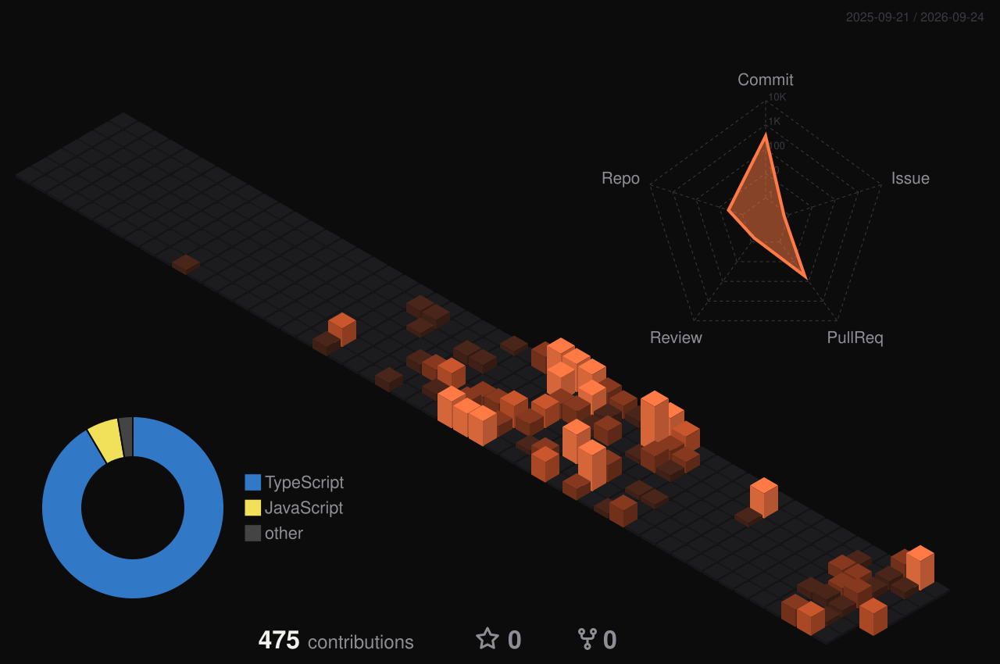

  <a href="https://thuvarahan.me">Portfolio</a>&nbsp;&nbsp;&nbsp;/&nbsp;&nbsp;&nbsp;<a href="https://www.linkedin.com/in/thuvarahan2003/">LinkedIn</a>&nbsp;&nbsp;&nbsp;/&nbsp;&nbsp;&nbsp;<a href="https://www.thuvarahan.me/Thuvarahan.T.pdf">Resume</a>&nbsp;&nbsp;&nbsp;/&nbsp;&nbsp;&nbsp;<a href="mailto:thuvarahan2003@gmail.com">Email</a>

 

I study IT at the University of Moratuwa and take on freelance work alongside it. Two platforms I built for clients are running in production today, and on both I handled everything from the database schema to the deploy.

Most of my time goes into the backend: Java and Spring Boot services, PostgreSQL, and the Docker and GitHub Actions setup that ships them. Lately I have been reading through the WSO2 Identity Server source to understand how authentication flows are put together.

I am looking for a software engineering internship, in Colombo or remote. Projects and the longer story are on [thuvarahan.me](https://thuvarahan.me).

 

  

  

