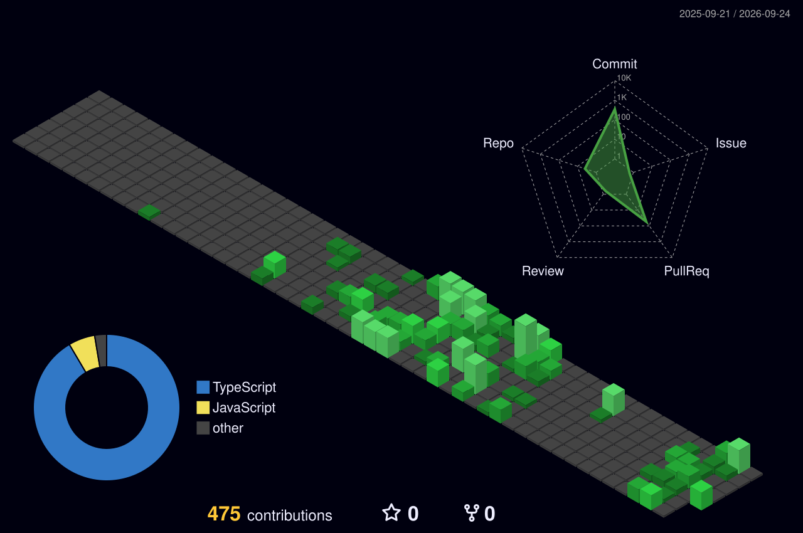

<!-- ─────────────────────────  HERO  ───────────────────────── -->
<a href="https://thuvarahan.me">
  
</a>

<div align="center">

<a href="https://thuvarahan.me">
  
</a>

<br/>

<a href="https://thuvarahan.me"></a>
<a href="https://www.linkedin.com/in/thuvarahan2003/"></a>
<a href="mailto:thuvarahan2003@gmail.com"></a>
<a href="https://www.thuvarahan.me/Thuvarahan.T.pdf"></a>


</div>

<br/>

<!-- ─────────────────────────  01 PROFILE  ───────────────────────── -->


<table>
<tr>
<td width="58%" valign="top">

### Build it, then ship it.

I'm **Thuvarahan** — a full-stack developer and IT undergraduate at the **University of Moratuwa** (GPA **3.6**), freelancing since **2024**.

Two client applications I built are **running in production** — [Vetworld](https://github.com/thuvarahan-t/vetworld) and [Physics Cube Academy](https://pca.lk) — and for both I owned the data model, the API and the deploy.

The work I want more of is **backend & DevOps**: Spring Boot services, PostgreSQL that holds up under real data, and the Docker + CI/CD that makes a release *boring*.

Building a power supply from the microcontroller up taught me the rest — **you measure before you trust the code.** That habit carries straight back to software.

</td>
<td width="42%" valign="top">

```yaml
thuvarahan:
  role:      Full-Stack Developer
  focus:     [Backend, DevOps, Cloud]
  based_in:  Sri Lanka 🇱🇰
  studying:  BSc (Hons) IT @ UoM
  shipping:  2 production apps
  exploring: WSO2 Identity Server
  speaks:
    - Tamil   (native)
    - English (full professional)
    - Sinhala (professional)
  status:    open to SE internships
             # Colombo or remote
```

</td>
</tr>
</table>

<details>
<summary><b>☕ The human behind the commits</b> — click to open</summary>
<br/>

- ♟️ **Chess coach, briefly.** Coached players at Singing Fish Chess Club and helped organise Batticaloa's biggest chess tournaments. I still think three moves ahead — in code reviews too.
- 📸 **Behind the lens.** Shooting events and cinematic moments on a **Nikon D5600** — sports for MoraSpirit, design and media for IEEE PES and the Tamil Literary Association.
- 🍜 **The paradox.** Huge foodie. Completely forgets to eat once the code "zone" kicks in.
- 🗣️ **Talker.** I can talk… a lot. I promise to keep it useful — and a little funny.
- 🌏 **Traveller.** I love new places, even if my motion sickness hates the journey.

</details>

<br/>

<!-- ─────────────────────────  02 STACK  ───────────────────────── -->


<p align="center"><sub>No percentages, no progress bars — every icon here was used on a real build.</sub></p>

<table align="center">
  <tr>
    <td align="center" width="140"><b>Languages</b></td>
    <td></td>
  </tr>
  <tr>
    <td align="center"><b>Frontend</b></td>
    <td></td>
  </tr>
  <tr>
    <td align="center"><b>Backend & Data</b></td>
    <td></td>
  </tr>
  <tr>
    <td align="center"><b>Cloud & DevOps</b></td>
    <td></td>
  </tr>
  <tr>
    <td align="center"><b>Tools</b></td>
    <td></td>
  </tr>
  <tr>
    <td align="center"><b>Design</b></td>
    <td></td>
  </tr>
  <tr>
    <td align="center"><b>Hardware</b></td>
    <td></td>
  </tr>
</table>

<br/>

<!-- ─────────────────────────  03 SELECTED WORK  ───────────────────────── -->


<table>
<tr>
<td width="50%" valign="top">

#### 🩺 Vetworld
<sub><code>CLIENT · SOLO · IN PRODUCTION</code></sub>

Veterinary-equipment e-commerce platform — requirements, UI/UX, backend, database and deployment, delivered solo and supported after launch.

  

[](https://github.com/thuvarahan-t/vetworld)

</td>
<td width="50%" valign="top">

#### 🎓 Physics Cube Academy
<sub><code>CLIENT · SOLO · IN PRODUCTION</code></sub>

Production web platform for a physics academy — student admissions, records and reporting, with the tooling around it built and maintained end to end.

  

[](https://pca.lk)

</td>
</tr>
<tr>
<td width="50%" valign="top">

#### 📋 Planora
<sub><code>TEAM OF 5 · 2025 · WITH AXZELL INNOVATIONS</code></sub>

Cross-platform project management — plan, track and report on work from web or mobile. **My scope:** dashboard analytics, reports, project summary, the full project-creation flow, portfolios and add-members — wired to REST services, plus PWA support.

   

[](https://planora-pma.netlify.app/)
[](https://github.com/axzellinnovations/project_management_app)
[](https://youtu.be/PYGISZM6s3o)

</td>
<td width="50%" valign="top">

#### ⚡ PowerHub
<sub><code>HARDWARE · LEVEL 01 · FACULTY OF IT</code></sub>

Microcontroller-based programmable regulated power supply — **0–12 V / 0–2 A**, UPS backup, solar charging and a battery management system, with a web control layer for real-time monitoring across USB, Li-ion and banana-port outputs.

  

[](https://github.com/thuvarahan-t/power-hub)
[](https://youtu.be/rkMGWQUnfZY)

</td>
</tr>
</table>

<p align="center">
  <sub>Also: <b>BookNest</b> — full-stack digital library (team of 5) · <b>identity-governance</b> — reading and experimenting inside the WSO2 Identity Server codebase.</sub><br/>
  <a href="https://thuvarahan.me"><b>See every project, with screenshots and decisions → thuvarahan.me</b></a>
</p>

<br/>

<!-- ─────────────────────────  04 BUILD LOG  ───────────────────────── -->


| Entry | When | What |
|:--:|:--|:--|
| 🟢 **05** | 2024 → now | **Freelance Full-Stack Developer** · self-employed, remote — two production apps, end to end, client-facing |
| 🎓 **04** | 2024 → now | **BSc (Hons) Information Technology** · University of Moratuwa — GPA 3.6 |
| 📜 **03** | 2025 | **SLIM Professional Certificate in Marketing** · ACIDM — the vocabulary clients use for what a product should do |
| 🏫 **02** | 2023 | **G.C.E. A/L** · St. Michael's College, Batticaloa — Z-score 1.6843 |
| 🏫 **01** | 2023 | **G.C.E. O/L** · St. Michael's College, Batticaloa — 9 A |

<details>
<summary><b>🏅 Courses & certifications</b> (6)</summary>
<br/>

| Track | Certificate | Issuer |
|:--|:--|:--|
| ☁️ Cloud | AWS Fundamentals | AWS · Coursera |
| ⚙️ DevOps | DevOps, Cloud and Agile Foundations | IBM · Coursera |
| 🐳 Cloud-native | Cloud-Native Development with OpenShift and Kubernetes | Red Hat · Coursera |
| 🧱 Full-stack | Meta Full-Stack Developer | Meta · Coursera |
| ☕ Java | Advanced Certificate in Java Programming | ITDLH · Ministry of Education |
| 🐍 Python | Introduction to Python & Web Design | Open UoM |

</details>

<br/>

<!-- ─────────────────────────  05 FIELD WORK  ───────────────────────── -->


<p align="center"><sub>A camera, Illustrator, and a deadline that arrives whether the code compiles or not.</sub></p>

<div align="center">

| 🎨 IEEE PES Student Branch | 📸 MoraSpirit & FIT Moments | 🎬 Tamil Literary Association | ♟️ Singing Fish Chess Club |
|:--:|:--:|:--:|:--:|
| Creative Designer | Photographer | Media Specialist | Chess Coach |
| flyers · promo videos | sports & faculty events | Tamil student events | Batticaloa tournaments |

</div>

<br/>

<!-- ─────────────────────────  06 GITHUB  ───────────────────────── -->


<div align="center">

<picture>
  <source media="(prefers-color-scheme: dark)" srcset="./profile-3d-contrib/profile-night-green.svg"/>
  <source media="(prefers-color-scheme: light)" srcset="./profile-3d-contrib/profile-green-animate.svg"/>
  
</picture>


<picture>
  <source media="(prefers-color-scheme: dark)" srcset="https://raw.githubusercontent.com/thuvarahan-t/thuvarahan-t/output/snake-dark.svg"/>
  <source media="(prefers-color-scheme: light)" srcset="https://raw.githubusercontent.com/thuvarahan-t/thuvarahan-t/output/snake-light.svg"/>
  
</picture>

</div>

<br/>

<!-- ─────────────────────────  FOOTER  ───────────────────────── -->
<a href="mailto:thuvarahan2003@gmail.com">
  
</a>

<div align="center">
<sub><b>Operating principles:</b> data model before screens · if it only deploys from my laptop, it isn't done · measure it before you trust it.</sub>
</div>
